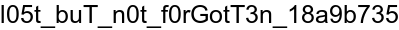

# Archival
## Challenge
#### tl;dr:
Either patch the archive to recognize `flag.png` or xor the ciphertext using the keys stored in the file
#### Description:
> Check out this weird file I found. I think this program has something to do with it too?
### Initial RE
We are given three files. An executable, the source for that executable, and a binary blob. 
```
$ file *
arc.bin:     data
extract.c:   C source, ASCII text
extract.txt: ELF 64-bit LSB shared object, x86-64, version 1 (SYSV), dynamically linked, interpreter /lib64/ld-linux-x86-64.so.2, for GNU/Linux 3.2.0, BuildID[sha1]=66d0481f6be6daecd1600a273047e8a2b5c59d78, not stripped
```
If we run the binary we're given on `arc.bin` it creates four image files. 
```
$ ./extract.txt 
Usage: ./extract.txt <archive> <output directory>
$ mkdir asdf
$ ./extract.txt arc.bin asdf
$ ls asdf/
aaaa.png  paint.png  sentence.png  yeehaw.png
```
Given the name of the challenge and the fact that it just turned one file into four, it's reasonable to assume that we're dealing with some sort of custom archive file format. The question is, where is the flag? Let's see how this format keeps track of file names:
```
$ xxd arc.bin | grep -C1 .png
00000010: 2000 0000 6253 68f4 d640 259c e6bc 0582   ...bSh..@%.....
00000020: 17a6 0600 e191 7965 6568 6177 2e70 6e67  ......yeehaw.png
00000030: 00c1 68d6 af9b ec9b fb91 e19c e1d9 a8c3  ..h.............
--
0006a630: a8d5 afd3 4f13 812b 4f65 8402 0000 15d9  ....O..+Oe......
0006a640: 6161 6161 2e70 6e67 0089 9c9e 5bd3 18d3  aaaa.png....[...
0006a650: 0fd9 15d4 1591 5c8b 51d9 152d 17d9 15c7  ......\.Q..-....
--
0006b760: d6cf d7c8 d128 11e6 aa94 95f9 0600 f805  .....(..........
0006b770: 7061 696e 742e 706e 6700 5571 42b6 0ff5  paint.png.UqB...
0006b780: 0fe2 05f8 08f8 4db1 57bc 05f8 25fa 05f8  ......M.W...%...
--
000ca2c0: c88b 5f62 7e09 bad0 1db4 3725 883e 1b94  .._b~.....7%.>..
000ca2d0: c2eb 8d4c 4ead c2ff 6226 c39e 706e 671b  ...LN...b&..png.
000ca2e0: b705 1ca9 ed88 a35c 4636 cd47 43e8 d531  .......\F6.GC..1
--
000db100: 3db9 bff7 28f0 e20b bb76 0a00 00e7 1f66  =...(....v.....f
000db110: 6c61 672e 706e 6700 4f6e 58a9 15ea 15fd  lag.png.OnX.....
000db120: 1fe7 12e7 57ae 4da3 1fe7 90e6 1fe7 01e7  ....W.M.........
```
Awesome. So the archive has strings for each of the four files it extracted plus a `flag.png` in it. Presumably it contains the flag. Now we just need a way to extract it.
## Solution 1 - patching the file
This way of solving the challenge approaches it more as a forensics problem than an RE problem. The way to think about it is, "I have this unknown file format, how can I figure out how it's constructed." To make a structured file format, you need to include metadata--that is, data about the actual data. Let's start with the first few bytes of the file:
```
$ xxd -g 4 arc.bin | head -2
00000000: 04000000 6ab70600 3aa60600 cfa80600  ....j...:.......
00000010: 20000000 625368f4 d640259c e6bc0582   ...bSh..@%.....
```
The first 4 bytes are 0x4 in little endian. That's the same as the number of files that the executable extracted. Coincidence?
```c
char *buff = read_file(argv[1], &sz);
/* snipped for brevity */
int filecnt = *(int *) buff;
```
A quick look at the source reveals that a variable called 'filecnt' is set as the first `int` of the file. Thus, we can conclude that the first four bytes are the number of files that the extractor will extract. 

Given that we're extracting four files, let's assume that the next four values (or sets of values) are meaningful, we see that for the next three `int`s of data, they each begin with `0x0006` With no other discernible pattern between them and the start of the first file (`yeehaw.png`). Let's assume that these three `int`s are meaningful. However, since we're looking for four values, that would mean the following `0x20` is also is also part of this same set. All four files are pngs, so `0x20` doesn't make sense as a length field. Since this is an archive file, these values may indicate the offset to the start of each file from the start of the archive; let's see what's at `0x20`:
```
$ xxd -g 4 arc.bin | grep 00000020
00000020: 17a60600 e1917965 65686177 2e706e67  ......yeehaw.png
```
Okay... we have the name of one of the files; this looks promising. Let's see what data is at the other offsets:
```
0006A8CC   65 ED C6 99  0E 00 00 86  93 73 65 6E  74 65 6E 63  65 2E 70 6E  67 00 C3 0F  D4 C8 99 8B  e........sentence.png.......
0006A62C   E1 91 E1 D4  A8 D5 AF D3  4F 13 81 2B  4F 65 84 02  00 00 15 D9  61 61 61 61  2E 70 6E 67  ........O..+Oe......aaaa.png
0006B764   D1 28 11 E6  AA 94 95 F9  06 00 F8 05  70 61 69 6E  74 2E 70 6E  67 00 55 71  42 B6 0F F5  .(..........paint.png.UqB...
```
Cool. The names of the other files are located near those offsets as well. At this point it's reasonable to assume that these next four `int`s relate to the location of each of the files in the archive relative to the start of the file. By subtracting the start of the file name from the offset at the beginning of the file, we see that the pointer points to 6 bytes before the start of the file name. At this point the work is done and the solution is pretty easy:
1. Replace the `0x4` at the beginning of the file with `0x5` because we want to extract the `flag.png` as well
2. Place a pointer to the location of 'flag.png' - 6 after the `0x5` but before the other pointers (because the pointers go in descending order and the `flag.png` is last in the file)
3. Run the extractor on the patched archive
4. Optional: segfault because we did something wrong
5. Profit?
```
$ printf '\x05\x00\x00\x00\x0d\xb1\x0d\x00' > arc.bin.patched
$ dd if=arc.bin of=trailer bs=1 skip=4
899963+0 records in
899963+0 records out
899963 bytes (900 kB, 879 KiB) copied, 9.31964 s, 96.6 kB/s
$ cat trailer >> arc.bin.patched
$ ./extract.txt arc.bin.patched asdf
Error parsing file
$ ls asdf
flag.png
```
It didn't extract any of the other files, but we got `flag.png`!

##### Disclaimer:
This writeup is me trying to relive my thought process on how I initially solved this challenge weeks ago. If I make any unreasonable jumps in reasoning, it is because I accidentally left out some observation I had made at the time. Frequently checking the program's source will allow us to confirm all of our assumptions, but I wanted to leave all of the actual RE for solution 2. 
## Solution 2 - xor the file
TODO (if I have time)
tl;dr: look at the source, see that bytes 4 and 5 are key1 and key2 and the png is xor'd with these keys. undo the xor
